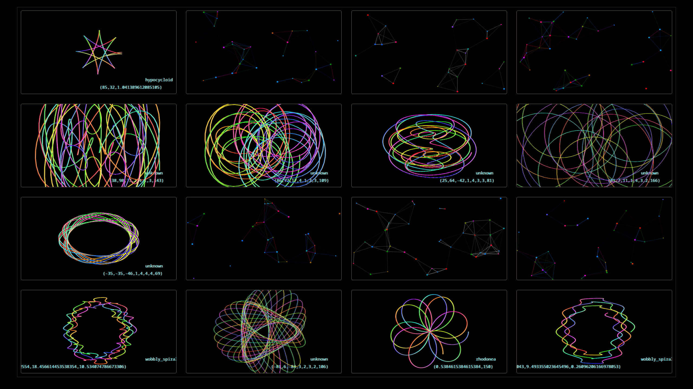
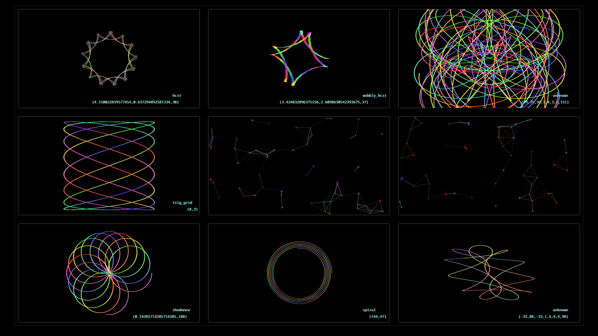

# Multiple Canvases

- Uses OOP / ES6 classes to facilitate multiple HTML canvases with different stuff going on in each one!
- In the first prototype, it demonstrated displaying colourful realtime graphs of various parametrically-defined functions.
- Now it incorporates particle systems.
- In the future, other interesting effects will be showcased.
- This is very much a prototype, much more incredibly awesome functionality will follow!
- Deployed to https://teraspora.github.io/multiple_canvases/
- Press a digit key `n` (`1` to `9`) to change the resolution and display n2 canvases.   Note that this will re-initialise everything else.
- If you don't want to see the curve annotations, press `c`.   This acts as a toggle, and will also re-initialise each canvas.

This is partly a scaffold for doing graphics on HTML canvases, and partly a demonstration of using OOP principles to encapsulate functionality and facilitate the creation of multiple instances of entities (like canvases, or other DOM elements) with different parameters supplied to them.

I may subsequently recreate the important component classes (currently `Scene`, `CurveScene`, `Atom`, `AtomScene`) as Svelte components, and rewrite the whole thing in Svelte, but for the time being I am happy playing in raw JS!

